# Developer Challenge February 2024

SAP Cloud Application Programming Model (CAP) plugins are extensions to the CAP framework that enable developers to enhance the capabilities of their CAP-based applications. These plugins can be used to add custom features, integrate with external services, or modify the default behavior of the CAP framework. In the February 2024 Developer Challenge, you are going to learn just how easy and powerful these extensions are.  We will build a simple, sample CAP application and then each week your challenge will be to integrate a different plugin into this application.

## Key aspects of CAP plugins include

1. **Customization and Extension**: Plugins allow developers to extend the core functionality of CAP by adding custom logic, services, or features that are not part of the standard CAP framework.

1. **Integration**: They can be used to integrate CAP applications with other SAP solutions, third-party services, or APIs. This helps in building more comprehensive and connected systems.

1. **Reusability**: Plugins can be developed in a way that they are reusable across different CAP projects. This promotes code reuse and consistency across applications.

1. **Community Contributions**: Apart from official SAP-provided plugins, the community of developers can create and share their own plugins, fostering an ecosystem of tools and extensions.

1. **Simplified Development**: By encapsulating complex or repetitive tasks into plugins, developers can simplify the application development process, focusing more on business logic rather than boilerplate code.

1. **Configuration and Customization**: Plugins often come with configurable options allowing developers to tailor them according to specific project requirements.

Overall, CAP plugins are a powerful way to extend the capabilities of the SAP Cloud Application Programming Model, enabling developers to build more feature-rich, integrated, and efficient applications.

[https://cap.cloud.sap/docs/plugins/](https://cap.cloud.sap/docs/plugins/)

## Types of Plugins for Node.js

1. [**GraphQL Adapter**](https://github.com/cap-js/graphql): This plugin automatically generates a GraphQL schema for application models and allows querying services using GraphQL. It's activated by adding a @graphql annotation to service definitions.

1. [**OData v2 Proxy**](https://github.com/cap-js-community/odata-v2-adapter): This protocol adapter exposes services as OData v2 services, converting OData V2 requests to CDS OData V4 calls and responses.

1. [**UI5 Dev Server**](https://github.com/ui5-community/ui5-ecosystem-showcase/tree/main/packages/cds-plugin-ui5#cds-plugin-ui5): Integrates UI5 tooling-based projects into the CDS server, serving dynamic UI5 resources and transpiling TypeScript implementations for UI5 controls.

1. [**Change Tracking**](https://github.com/cap-js/change-tracking): Automatically captures, stores, and views changes in modeled entities. Entities and elements for change tracking are specified using @changelog annotations.

1. [**Audit Logging**](https://github.com/cap-js/audit-logging): Logs personal data-related operations with the SAP Audit Log Service, using annotations to mark entities and fields related to personal data.

1. [**Notifications**](https://github.com/cap-js/notifications): Integrates with the SAP Alert Notifications service to send notifications via various channels (email, Slack, Microsoft Teams, SAP Fiori). It provides a simple programmatic API for sending notifications.

## Key Features

1. Simplicity and Ease of Use: Many plugins have a minimalistic setup and offer a plug-and-play experience.
1. Annotation-Based Configuration: Plugins like Audit Logging and Change Tracking use annotations for configuration, making them easy to implement.
1. Integration with SAP Services: Plugins offer seamless integration with various SAP services for enhanced functionality.
1. Support for Multiple Formats: The OData v2 Proxy and GraphQL Adapter allow services to be exposed in different data formats.
1. Development and Production Logging: Plugins support logging in both development and production environments, with features like transactional outbox for scalability and resilience.

## Week 1 Challenge

Week 1 of the challenge will be the most time consuming of all the weeks, simply because we need to get an initial sample application running. After we have our baseline project, this week and all subsequent weeks will just focus on adding one or more CAP plugins to that project.

### Initial Project Creation

We will walk you through the initial project creation step-by-step.  But later in the challenge once you are adding the plugins you will be expected to figure out that part on your own. That's the "challenge" after all.

1. You can create your CAP project anywhere that [CAP development has tooling](https://pages.github.tools.sap/cap/docs/tools/). That could mean the [SAP Business Application Studio](https://pages.github.tools.sap/cap/docs/tools/index#bastudio), [Microsoft Visual Studio Code](https://pages.github.tools.sap/cap/docs/tools/index#vscode), or really most any IDE, text editor, or [command line](https://pages.github.tools.sap/cap/docs/tools/index#command-line-interface-cli).  The screenshots and steps we are going to describe do use wizards and other tooling that's primarily available in both the SAP Business Application Studio or Microsoft Visual Studio Code with the SAP Cloud Application Studio extension.
1. Start the IDE's Project Wizard. [From SAP Business Application Studio, the wizards can be triggered from the Get Started page](https://help.sap.com/docs/bas/developing-cap-application-in-sap-business-application-studio/creating-project). From VSCode, you can begin by choosing `Open Template Wizard` from the Command Pallet.
1. Choose the `CAP Project` as your Generator (IE wizard) type.
    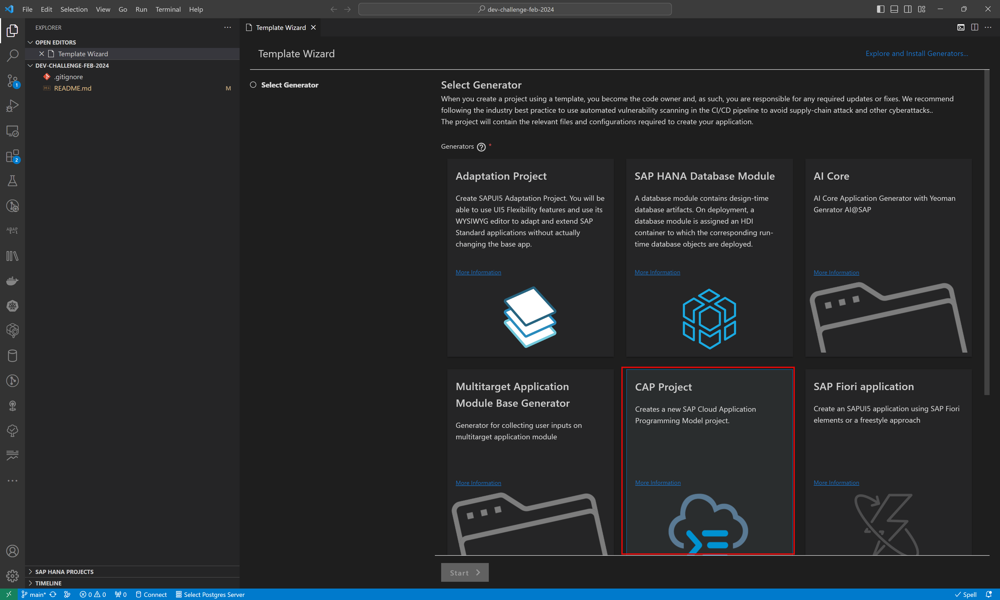
1. In the project details, name your project. I used `dev-challenge-feb-2024` as my name, but you can choose what you want.
    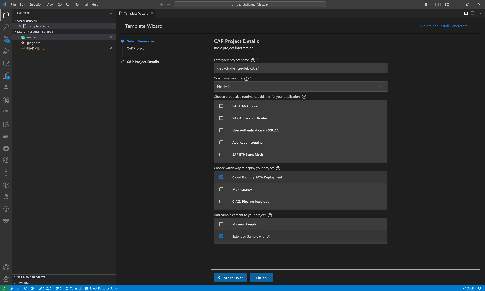
    1. Select `Node.js` as your runtime.
    1. Choose `Cloud Foundry: MTA Deployment` as the way to deploy your project
    1. Check the `Extended Sample with UI` option for adding sample content to your project. This is the most important item as this will give us a starter project ready to use so that we can focus on CAP plugins.
    1. Double check your entires and press `Finish`
    >Note: You can also create your project using the [cds command line](https://pages.github.tools.sap/cap/docs/tools/#cds-init-add) with the command: `cds init --add nodejs,mta,sample`
1. After a moment or two, your project should be generated and visible in your Project Explorer view. You will find UI parts in the `/app` folder, database object definition in the `/db` folder, and service defintion and implementation in the `/srv` folder. Also make note of the `package.json` file in the root of the project. This is where most of the important configuration for CAP and especially plugins will be performed.
    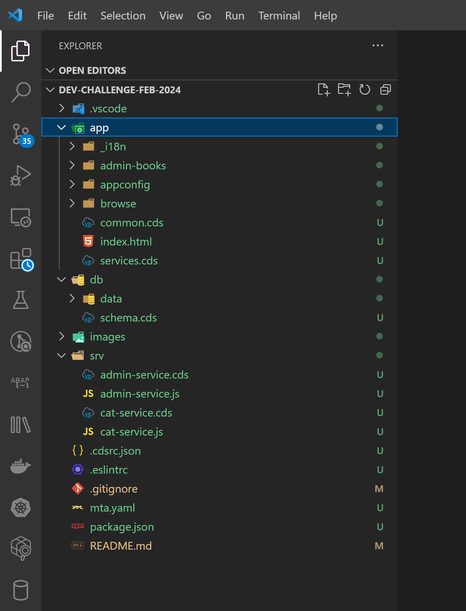
1. The project is really quite complete and nearly ready to test.  The only thing you need to do first is to run the command `npm install` from the terminal. This will ensure that all external dependencies (including CAP itself) get installed into your project.
    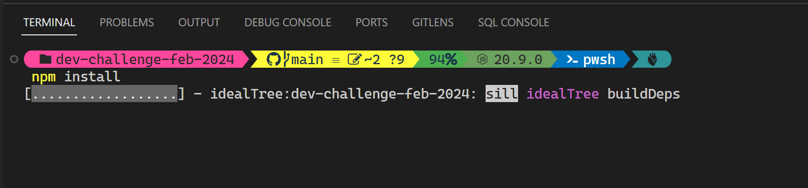
1. After the `npm install` completes, you are ready to test your project. You can do this by issuing the command from the terminal: `npm start`.  This will trigger the `cds-serve` of your project.
    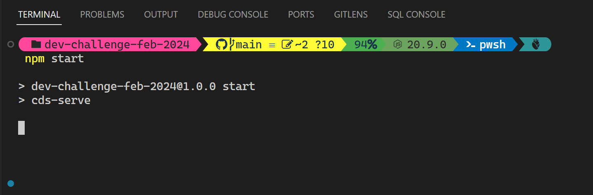
1. This command starts a CAP server in your development environment. This allows us to test locally on our development machine or in the cloud with a virtual machine/dev space if using the SAP Business Application Studio.  This gives us quick testing and debugging capabilities without having to fully deploy the application to SAP BTP. You will see the start deploying of test data from CSV files, the authentication strategy and which services are running from which endpoints. Finally there is the URL which we can open in a web browser to test our application.
    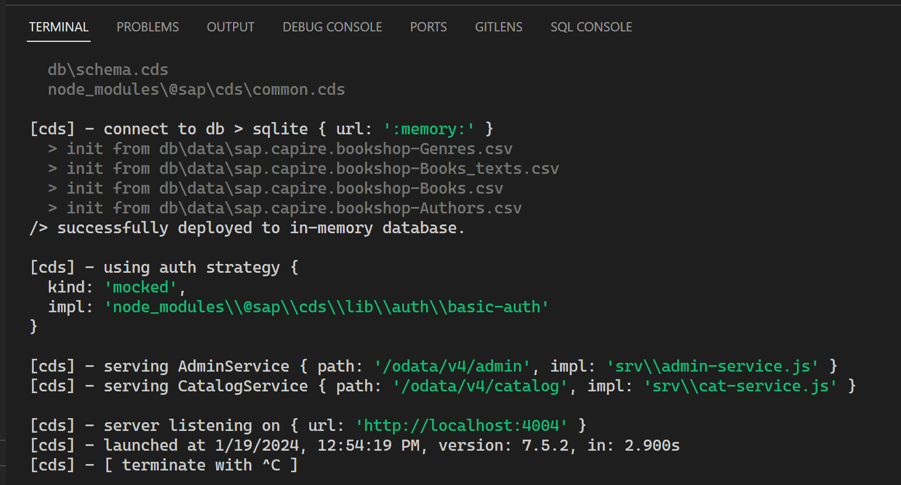
1. As long as you choose the extended sample in the project wizard, you should see a Fiori UI that allows you test the sample application.
    
1. This is a nice UI but we also want to use the built-in CAP testing page. It's currently overridden by the `index.html` in the `/app` folder that is the Fiori LaunchPad. Let's just rename that `index.html` file to `indexFLP.html`.
    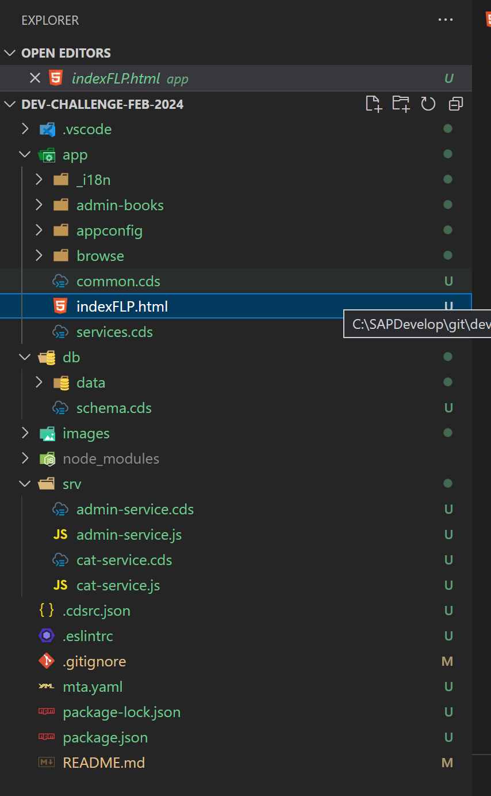
1. Rerun the application and now you should see the CAP test page by default. You wiĺl have direct links to test individual entities from the OData Services, view the metadata documents but you can also still find a link to the Fiori application under `Web Applications`
    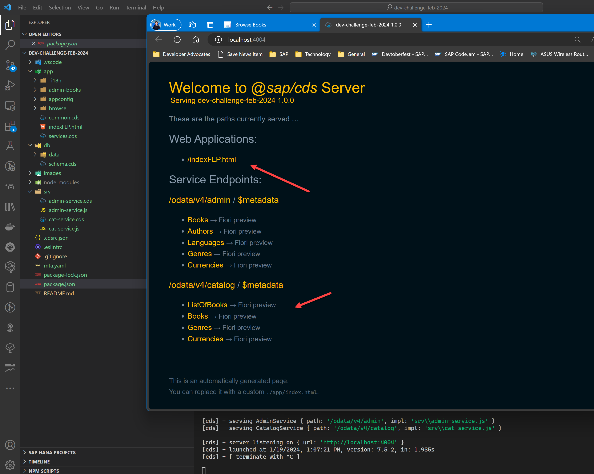

### Adding the OData V2 plugin

We have our running CAP application and it exposes OData V4 services and has a nice annotation based Fiori UI. You are ready for the real challenge to begin.

OData V4 support is excellent, but what if you also need OData V2 for backwards compatibility? This is the first of the CAP Plugins we will use. Your challenge, should you choose to accept it, is to use what you have learned about CAP plugins here and use the [`@cap-js-community/odata-v2-adapter`](https://www.npmjs.com/package/@cap-js-community/odata-v2-adapter) plugin. You should be able to complete this challenge with a single command!

1. After adding support for OData V2, run your application again. You should see log entries during startup that indicate the OData V2 proxy was created.
    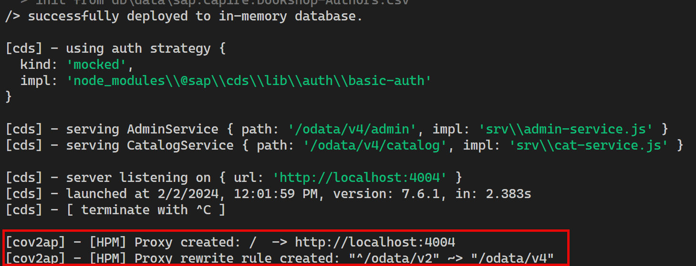
1. You will also see that your test page automatically adapted and now has links to test the Odata V2 endpoints as well as view the V2 metadata documents.
    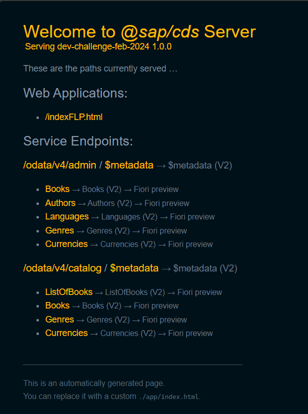
1. To complete the challenge, post a screenshot of your test page with the V2 endpoints as a response here in this thread.

>**Bonus 1:** Use the test tool to compare the format and structural differences between OData V2 and OData V4 both on the service endpoints and the metadata documents.

>**Bonus 2:** using only configuration in the package.json, change the default path from `/odata/v2` to `/devchallenge/v2` for only the OData V2 service endpoint.
    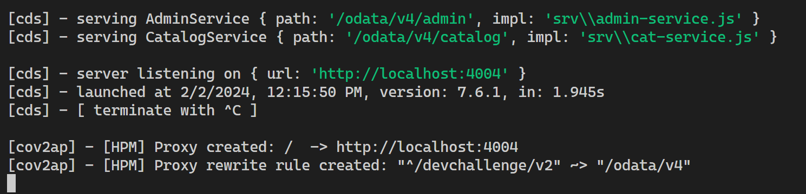

## Next Weeks

1. [Week 2](./week2.md)
1. [Week 3](./week3.md)
1. [Week 4](./week4.md)