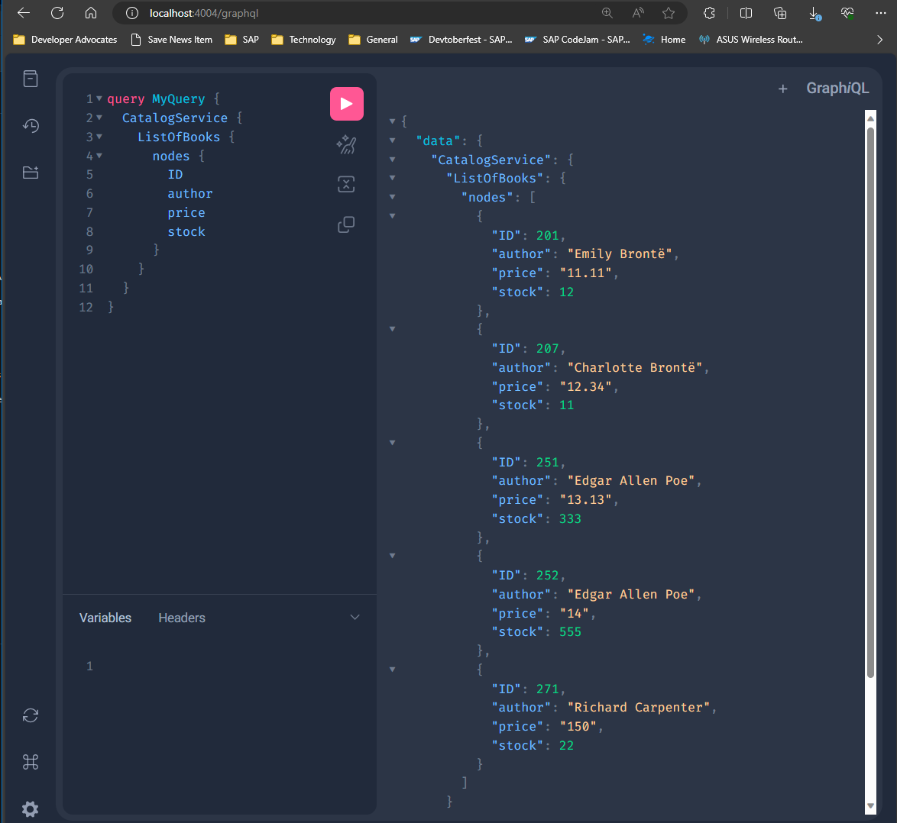
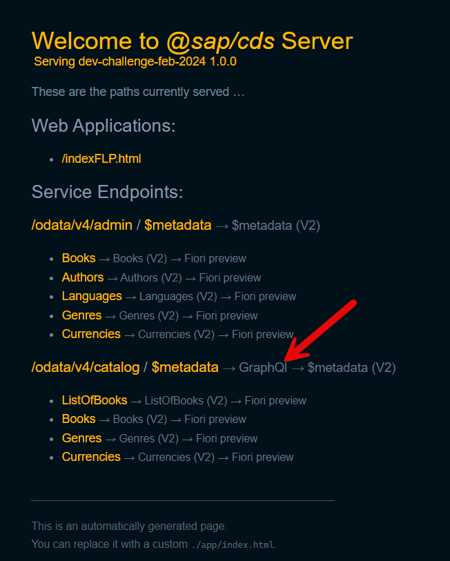

# Developer Challenge February 2024 - Week 2

If you missed week 1, you can find all the details: [here](./README.md)

This week's challenge is going to build upon what we learned last week with the OData V2 plugin.  We will continue working with the same project, but now we want to add support for GraphQL.

## What is GraphQL?

[GraphQL](https://graphql.org/) is a query language for APIs and a runtime for executing those queries by using a type system you define for your data. Unlike REST, which uses multiple URLs to access different resources, GraphQL accesses all the resources from a single endpoint with queries that articulate exactly what data is needed.

GraphQL and OData are both specifications for building and consuming APIs but take different approaches to some aspects.

GraphQL is a query language for APIs and a runtime for executing those queries by using a type system you define for your data.

OData defines a set of best practices for building and consuming RESTful APIs. It extends REST by providing a uniform way to describe both the data and the data model, enabling more detailed queries and interactions with the data.

## How does this impact the SAP Cloud Application Programming Model?

The SAP Cloud Application Programming model was designed to be protocol agnostic as much as possible. While OData V4 is the default service type exposed by CAP applications; CAP was never intended to only support OData or just one version of that specification. Therefore its possible from a single model and service definition to support both OData and GraphQL even with the differences in approaches used by the two different protocols!

## Your Task this week

Use the GraphQl Adapter plug-in to add GraphQL support to your project and to ONLY the `CatalogService` endpoint. And make sure that this same service also still supports OData V4 in parallel.

*[GraphQL Adapter](https://cap.cloud.sap/docs/plugins/#graphql-adapter): The GraphQL Adapter is a protocol adapter that generically generates a GraphQL schema for the models of an application and serves an endpoint that allows you to query your services using the GraphQL query language.*

[https://github.com/cap-js/graphql](https://github.com/cap-js/graphql)

To complete the challenge, post a screenshot from the graphql test tool (which can be accessed from `/graphql` url of your application) running a query against the `ListOfBooks` entity in the `CatalogService`.
    

>**Bonus 1:** The test tool doesn't automatically include a link to the GraphQL test tool. But using a `server.js` file we can use the `on serving` event to extend the CAP test tool ourselves. Your bonus challenge is add the code to your project to expose a link in the test tool to the GraphQL page but only for the service endpoints that support GraphQL. **Hint:** Several of the samples in the SAP-Samples repository on GitHub perform this technique.

