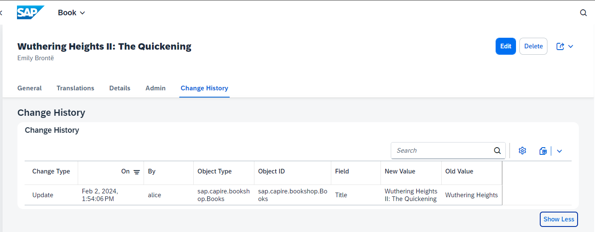
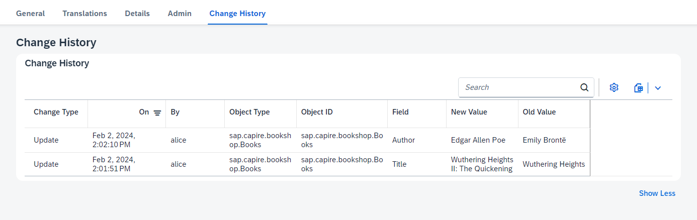

# Developer Challenge February 2024 - Week 3

If you missed week 2, you can find all the details: [here](./week2.md)

For this week's challenge we are going to mix things up. Week 1 and week 2 both focused on extending the protocol or version of service endpoints. This week we will use a plugin that has a completely different purpose.  We are going use the [Change Tracking](https://cap.cloud.sap/docs/plugins/#change-tracking) plugin. This plugin both extends the data model and the Fiori UI automatically. It stores change history information, exposes it within our service and adds a Change History UI element to our Fiori application; all with extremely minimal effort on your part!

## Your Task this week

*The [Change Tracking](https://cap.cloud.sap/docs/plugins/#change-tracking) plugin provides out-of-the box support for automated capturing, storing, and viewing of the change records of modeled entities. All we need is to add @changelog annotations to your models to indicate which entities and elements should be change-tracked.*

[https://github.com/cap-js/change-tracking](https://github.com/cap-js/change-tracking)

Your task is to add change tracking to the `Books` entity and the `Title` attribute in your application.

To complete the challenge, post a screenshot of the Fiori UI for managing Books with the Change History with a change entry displayed.
    

>**Bonus 1:** Add change tracking to the `Books.Author` association.  However, don't display the unique ID when the association is changed. Instead the change log should record and display the Author Name.
    