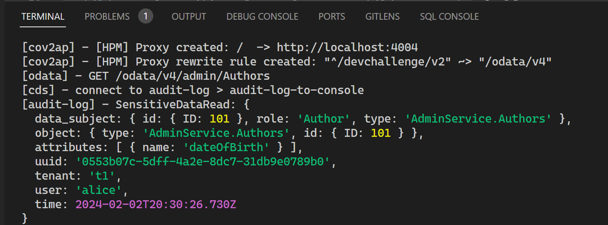
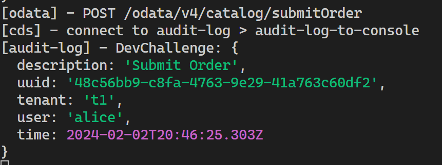
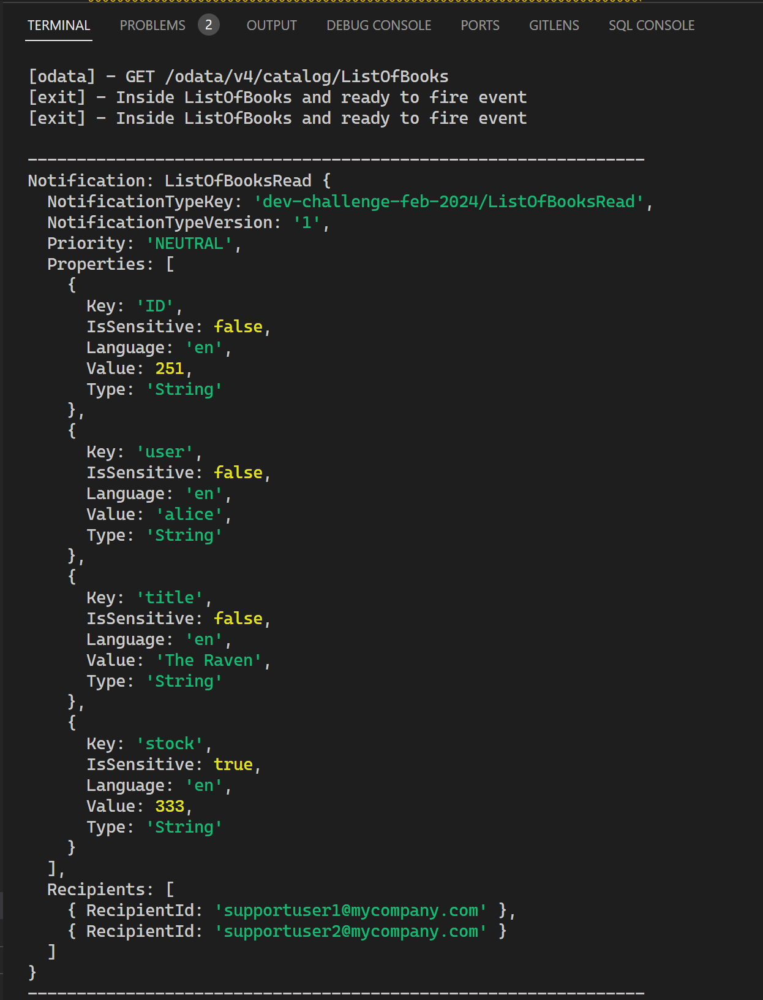
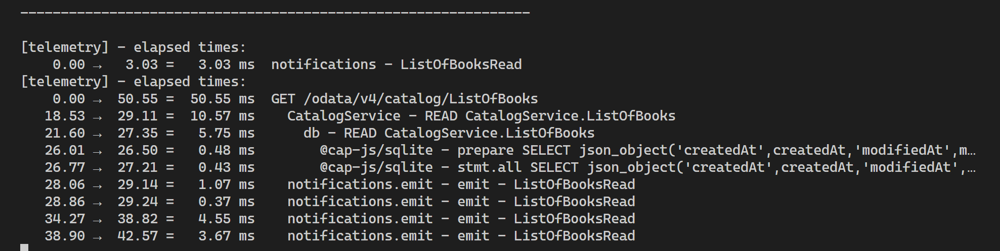

# Developer Challenge February 2024 - Week 4

If you missed week 3, you can find all the details: [here](./week3.md)

For the final week we are going to go all in. We have several remaining plugins and your challenge this week is to integrate all of them into your application.

## [Audit Logging](https://cap.cloud.sap/docs/plugins/#audit-logging)

*The new Audit Log plugin provides out-of-the box support for logging personal data-related operations with the SAP Audit Log Service. All we need is annotations of respective entities and fields.*

[https://github.com/cap-js/audit-logging](https://github.com/cap-js/audit-logging)

Add the Audit Logging plugin to your application and add Personal Data Annotations to the `Books` entity. Share your screenshot of the audit entries after accessing the entity.
    
>Bonus: Add a custom audit log entry when the `submitOrder` action is triggered
    

## [Notifications](https://cap.cloud.sap/docs/plugins/#notifications)

*The Notifications plugin provides integration with the SAP Alert Notifications service to send notifications via email, Slack, Microsoft Teams, or SAP Fiori notifications. The client is implemented as a CAP service, which gives us a very simple programmatic API*

[https://github.com/cap-js/notifications](https://github.com/cap-js/notifications)

Add the Notifications plugin to your application. Throw a notification every time `ListOfBooks` entity is read and a discount has been applied. Post a screenshot of your notification in the log.
    

## [Telemetry](https://cap.cloud.sap/docs/plugins/#telemetry-beta)

*The Telemetry plugin provides observability features such as tracing and metrics, including automatic OpenTelemetry instrumentation. Simply add the plugin to your project and you will find telemetry output written to the console*

[https://github.com/cap-js/telemetry](https://github.com/cap-js/telemetry)

Add the Telemetry plugin to your application. Post a screenshot of the telemetry output in our log.
    